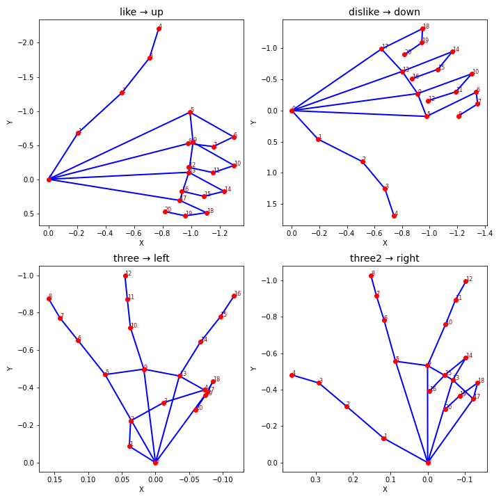

# ML Course Final Project - Gesture Control Game

This project implements a gesture-controlled game using machine learning for gesture recognition. Players can control the game using hand gestures captured through their webcam.

## 🚀 Quick Start

1. Install the Live Server extension in VS Code:
   - Open VS Code
   - Go to Extensions (Ctrl+Shift+X)
   - Search for "Live Server"
   - Install the extension by Ritwick Dey

2. Launch the project:
   - Right-click on `index.html`
   - Select "Open with Live Server"
   - The game should open in your default browser at `http://localhost:5500`

## 📁 Project Structure

- `index.html` - Main game interface
- `api-call.js` - ML model API integration
- `cam.js` - Webcam handling and gesture processing
- `keyboard.js` - Keyboard controls implementation
- `maze.js` - Maze game logic
- `mp.js` - Media processing utilities

## 🔧 Important Implementation Note
    

To call the server we use the following commande in api-call.js to call the model API

<pre>
const response = await fetch('https://endearing-emotion-production-ffc2.up.railway.app/predict-landmark', {
  method: 'POST',
  headers: {
    'Content-Type': 'application/json'
  },
  body: JSON.stringify(payload)
});
</pre>

## 🖼️ Gesture Reference

The following image shows the gestures used to control the game:

**Gesture → Direction mapping:**
- `like` → **up**
- `dislike` → **down**
- `three` → **left**
- `three2` → **right**

## 🎮 Controls

The game can be controlled through:
- Hand gestures (via webcam)
- Keyboard arrows (as fallback)
